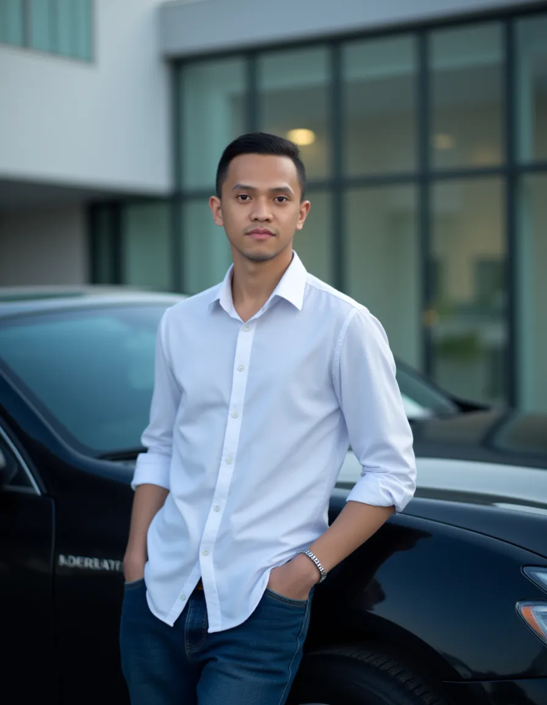

# Umar Bahabasi

  

## 👨‍💻 Backend Developer

---

## About Me

Results-driven Backend Developer with a strong foundation in designing, developing, and maintaining scalable and efficient server-side applications. Proficient in Golang, as well as other backend technologies, databases, and cloud services. Experienced in building RESTful APIs, microservices architecture, and optimizing system performance. Passionate about writing clean, maintainable code and implementing best practices for security and scalability. Adept at working in agile environments, collaborating with cross-functional teams, and delivering high-quality software solutions. Constantly learning and staying up-to-date with the latest backend development trends and technologies.

---

## Technical Skills

### Programming Languages
- PHP, NodeJs, Go

### Frameworks & Libraries
- Laravel, Express Js, Gin, CodeIgniter 

### ORM & APIs
- Sequelize, Gorm
- GraphQL, RestAPI

### Databases
- MySQL, MongoDB, Redis

### DevOps & Tools
- AWS, Alicloud, DigitalOcean
- Docker, GitHub, GitLab
- Jira, Notion
- OpenAI, CloudAI, Codeium

---

## Professional Experience

### Backend Developer | PT. Sinarmas Sekuritas, Jakarta
*December 2023 - Present*

- Develop and maintain backend services using the Go programming language, ensuring optimal performance and application scalability.
- Design and implement secure and efficient APIs for seamless integration between backend, frontend, and external services.
- Manage and optimize databases to support application needs, including schema design and data maintenance.
- Collaborate with other developers to plan application architecture, ensuring that the delivered solutions align with business requirements.
- Identify, analyze, and resolve performance and security issues in backend applications.
- Implement best practices in software development, including automated testing (unit testing and integration testing), code reviews, and continuous integration.

**Tools:** Go language, Jira Environment (workflows), MySQL, Docker, AliCloud, SonarQube Pipeline  
**Methodology:** Agile Scrum

### Fullstack Developer | PT. K-LINK Indonesia, Jakarta
*June 2019 - December 2023*

- Developed company information systems using PHP (CodeIgniter/Laravel), Node.js, and Golang, including backend API interfaces for monthly data reports and other functionalities.
- Successfully delivered and maintained multiple projects, including:
  - Service Kirim (Golang & Node.js)
  - Service Message (Golang)
  - Backend E-commerce (Node.js & Golang)
- Acted as the main responsible person for maintenance and bug fixing across all the above projects, ensuring system stability and performance.

**Tools:** PHP, CodeIgniter 3, MySQL, Laravel, Go Language, Gin, GitHub, GitLab, Docker, Notion, RabbitMQ, MongoDB, Node.js, AWS Cloud  
**Methodology:** Waterfall

### Fullstack Developer (Freelance) | Kementerian Desa dan PDTT
*January 2023 - December 2023*

- Employee Attendance & Daily Report System – Developed a custom attendance and daily reporting application for government employees, enhancing efficiency in attendance tracking and reporting.
- Company Profile Website – Designed and built a company profile application, providing businesses with a professional online presence and improved brand visibility.
- Seminar Scheduling & Recruitment System – Created a comprehensive scheduling system for seminars, employee recruitment, and job vacancy information, streamlining hiring and event management processes.
- Feature Development & Client Requests – Responsible for developing new features based on client requests, ensuring continuous improvement and system enhancement.

**Tech Stack & Tools:** PHP (Laravel, CodeIgniter 3), Go (Gin), Node.js, MySQL, MongoDB, RabbitMQ, Docker, GitHub, GitLab, AWS Cloud, Jira, Notion  
**Methodology:** Agile Scrum

### Fullstack Developer (Freelance) | CV. ROVR
*January 2023 - June 2023*

- Developed a web-based ticket booking system for VR game rentals using PHP (Laravel).
- Implemented secure payment methods and integrated third-party services to ensure a seamless booking experience.
- Managed the entire development process from system design to deployment, following the Waterfall methodology.

**Tools:** PHP (Laravel), GitHub, Jira, Payment Method Integration  
**Methodology:** Waterfall

### Fullstack Developer (Freelance) | PT. CITRAS MEDIA TECH, Malang East Java
*December 2017 - June 2018*

- Developed custom information systems tailored to client needs using PHP.
- Student Enrollment system - developed an online registration platform for a Pesantren in Batu city, streamlining the student admission process.
- Responsible for backend development and bug fixing for released applications, ensuring stability and performance.

### Fullstack Developer (Freelance) | CV. Golden Corner
*February 2016 - June 2017*

- Developed institutional support information systems, enterprise management systems, company profile websites, and hotel ticket booking systems using PHP (CodeIgniter 3).
- Led development as the responsible developer, ensuring system functionality, performance, and reliability.

**Tech Stack & Tools:** PHP (CodeIgniter 3), MySQL, GitHub  
**Methodology:** Waterfall

### Fullstack Developer | PT. Monitor Media Siber
*February 2017 - December 2017*

- Responsible for the maintenance and development of an online news portal, ensuring system stability, performance, and scalability.
- Implemented feature enhancements and optimized the platform using PHP (CodeIgniter/Laravel) to improve user experience and operational efficiency.

**Tech Stack & Tools:** PHP (CodeIgniter, Laravel), MySQL, GitHub

---

## Education

- **Bachelor's degree - College of Informatics Management** (June 2012 - May 2017)

---

## Languages

- Indonesian (Native)
- English (Professional)

---

## Contact Me

I'm open to backend and fullstack development opportunities. Feel free to reach out:

- Email: [umarbahabasi@gmail.com](mailto:umarbahabasi@gmail.com)
---

⭐️ From [cangkir13](https://github.com/cangkir13)
